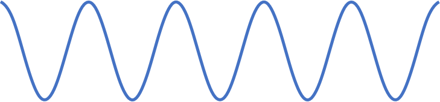

EdoliAddin

# Table of Contents
1. [Shape](#shape)
1. [Align](#align)
1. [Curve](#curve)
1. [Animation](#animation)
1. [Shortcuts](#shortcuts)

# Shape

Toggle line arrow


Size up arrow


Size down arrow


Connect shapes by lines


Invert image


Time image


# Align

Place labels on the bottom/left/right/top side of images


Transpose shapes


Group images and labels


Align shapes with previous slide


Align shapes with next slide


Swap multiple shapes


Align shapes in diagonal


Align shapes in grid automatically


Align shapes in grid with custom padding and column. Shapes are placed in row major order. The shapes are sorted in the selected order.


# Curve

Create polyline of equation


Create bezier curve of equation


This addin uses [expressive](https://github.com/bijington/expressive) for parsing equation. Use parameter `t` for drawing curve. Also the range should be set for `t`. There are some examples


```
Range: 0 - 10*PI
X: t
Y: Cos(t)
```


```
Range: 0 - 2*PI
X: Cos(t)
Y: Sin(t)
```


```
Range: 0 - 2*PI
X: Cos(3*t)
Y: Sin(2*t)
```


# Shortcuts

## Align
<kbd>CTRL</kbd>+<kbd>ALT</kbd>+<kbd>NUMPAD2</kbd>: Align bottom

<kbd>CTRL</kbd>+<kbd>ALT</kbd>+<kbd>NUMPAD4</kbd>: Align left

<kbd>CTRL</kbd>+<kbd>ALT</kbd>+<kbd>NUMPAD6</kbd>: Align right

<kbd>CTRL</kbd>+<kbd>ALT</kbd>+<kbd>NUMPAD8</kbd>: Align top

<kbd>CTRL</kbd>+<kbd>ALT</kbd>+<kbd>NUMPAD5</kbd>: Align center

<kbd>CTRL</kbd>+<kbd>ALT</kbd>+<kbd>H</kbd>: Align center horizontal

<kbd>CTRL</kbd>+<kbd>ALT</kbd>+<kbd>T</kbd>: Align center vertical

<kbd>CTRL</kbd>+<kbd>ALT</kbd>+<kbd>NUMPAD7</kbd>: Align in row

<kbd>CTRL</kbd>+<kbd>ALT</kbd>+<kbd>NUMPAD1</kbd>: Align labels to bottom

<kbd>CTRL</kbd>+<kbd>ALT</kbd>+<kbd>HOME</kbd>: Bring to front

<kbd>CTRL</kbd>+<kbd>ALT</kbd>+<kbd>END</kbd>: Send to back

<kbd>CTRL</kbd>+<kbd>ALT</kbd>+<kbd>PAGEUP</kbd>: Bring forward

<kbd>CTRL</kbd>+<kbd>ALT</kbd>+<kbd>PAGEDOWN</kbd>: Send backward

<kbd>CTRL</kbd>+<kbd>NUMPAD2</kbd>: Align bottom of

<kbd>CTRL</kbd>+<kbd>NUMPAD4</kbd>: Align left of

<kbd>CTRL</kbd>+<kbd>NUMPAD6</kbd>: Align right of

<kbd>CTRL</kbd>+<kbd>NUMPAD8</kbd>: Align top of

## Shape

<kbd>CTRL</kbd>+<kbd>ALT</kbd>+<kbd>0</kbd>: Toggle line

<kbd>CTRL</kbd>+<kbd>ALT</kbd>+<kbd>+</kbd>: Thickening line width

<kbd>CTRL</kbd>+<kbd>ALT</kbd>+<kbd>-</kbd>: Thinning line width

<kbd>CTRL</kbd>+<kbd>ALT</kbd>+<kbd>;</kbd>, <kbd>CTRL</kbd>+<kbd>ALT</kbd>+<kbd>'</kbd>: Change line dash style

## Object naming for animation

<kbd>CTRL</kbd>+<kbd>SHIFT</kbd>+<kbd>1</kbd>: Set object name to `!!ID1`

<kbd>CTRL</kbd>+<kbd>SHIFT</kbd>+<kbd>2</kbd>: Set object name to `!!ID2`

<kbd>CTRL</kbd>+<kbd>SHIFT</kbd>+<kbd>3</kbd>: Set object name to `!!ID3`

...
